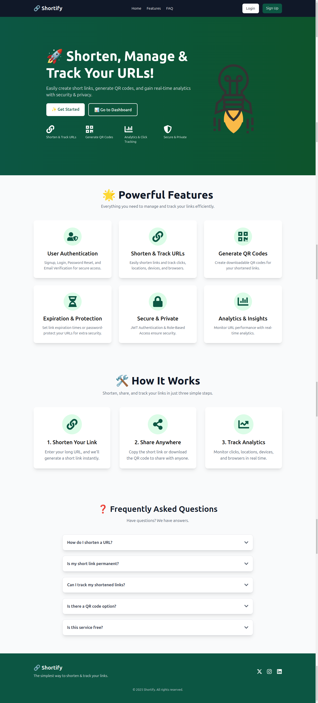
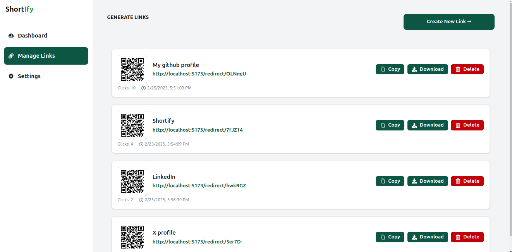
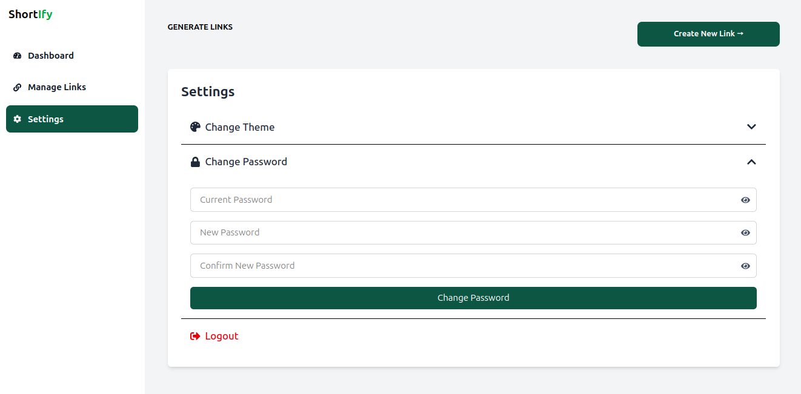

<h1 align="center">🚀 Shortify Frontend</h1>  
<p align="center">A sleek, modern, and responsive URL shortener built with React, Tailwind CSS, and Framer Motion.</p>  

<p align="center">
  
  
  
  
</p>  

---

## 📌 Table of Contents  
- [📸 Screenshots](#-screenshots)  
- [✨ Features](#-features)  
- [🛠 Technologies Used](#-technologies-used)  
- [🚀 Getting Started](#-getting-started)  
  - [🔹 Prerequisites](#-prerequisites)  
  - [🔹 Installation](#-installation)  
  - [🔹 Running the Application](#-running-the-application)  
- [📂 Project Structure](#-project-structure)  
- [🌍 Routes and Pages](#-routes-and-pages)  
- [🔧 API Integration](#-api-integration)  
- [🔑 Authentication and Authorization](#-authentication-and-authorization)  
- [⚠️ Error Handling](#-error-handling)  
- [🎨 Styling](#-styling)  
- [🤝 Contributing](#-contributing)  
- [📜 License](#-license)  

---

## 📸 Screenshots  
Here are some UI previews of **Shortify-frontend**:  

### 🏠 Home Page  
  

### 🔐 Login Page  
  

### ✍️ Register Page  
  

### 🔗 Manage Links Page  
  

### ⚙️ Settings Page  
  

---

## ✨ Features  

✅ **URL Shortening** – Convert long URLs into short, shareable links  
✅ **Link Management** – View, edit, and delete your links easily  
✅ **User Authentication** – Secure login, registration, and password management  
✅ **Personalized Dashboard** – Track analytics and manage links in one place  
✅ **QR Code Generation** – Generate QR codes for each shortened URL  
✅ **Admin Panel** – Manage users and monitor system performance  
✅ **Mobile Responsive** – Works on all screen sizes  
✅ **Animated UI** – Uses Framer Motion for smooth transitions  

---

## 🛠 Technologies Used  

| **Technology**  | **Usage**  |  
|----------------|-----------|  
| **React.js**   | Frontend framework  |  
| **Tailwind CSS** | Styling and responsiveness  |  
| **Framer Motion** | Animations and transitions  |  
| **React Router** | Client-side routing  |  
| **Axios** | API calls and HTTP requests  |  
| **React Hook Form** | Form handling  |  
| **Yup** | Form validation  |  

---

## 🚀 Getting Started  

### 🔹 Prerequisites  
Ensure you have the following installed:  
- **Node.js v14+** ([Download](https://nodejs.org/))  
- **npm** or **yarn** package manager  

### 🔹 Installation  

```bash
git clone https://github.com/ParamDhama/shortify-frontend.git
cd shortify-frontend
npm install  # or yarn install
```

### 🔹 Running the Application  

```bash
npm run dev  # or yarn dev
```
🔗 The app will be available at: **http://localhost:5173**  

---

## 📂 Project Structure  

```
shortify-frontend/
├── public/
├── src/
│   ├── api/
│   ├── components/
│   ├── pages/
│   ├── routes/
│   ├── utils/
│   ├── App.jsx
│   ├── main.jsx
│   └── index.css
├── package.json
├── README.md
└── vite.config.js
```

- **api/** – API handlers and endpoints  
- **components/** – Reusable UI components  
- **pages/** – Page components mapped to routes  
- **routes/** – Route configurations  
- **utils/** – Utility functions and helpers  

---

## 🌍 Routes and Pages  

| **Route** | **Description** |  
|----------|--------------|  
| `/` | Home Page |  
| `/redirect/:slug` | Redirects to original URL |  
| `/auth/login` | User Login |  
| `/auth/sign-up` | User Registration |  
| `/user/dashboard` | User Dashboard |  
| `/admin` | Admin Panel |  
| `*` | 404 Not Found |  

---

## 🔧 API Integration  

Uses **Axios** for handling HTTP requests:  

```javascript
import apiClient from '../api/apiClient';
import endpoints from '../api/endpoints';

const fetchUrls = async () => {
  try {
    const response = await apiClient.get(endpoints.url.GET_URLS);
    console.log(response.data);
  } catch (error) {
    console.error("Error fetching URLs:", error);
  }
};
```

API Endpoints are stored in `endpoints.js` for easy management.  

---

## 🔑 Authentication and Authorization  

✔️ **JWT-based Authentication** – Secure login and access control  
✔️ **Protected Routes** – Prevents unauthorized users from accessing pages  
✔️ **Token Storage** – Uses localStorage for session persistence  

Example **Protected Route**:  

```javascript
function ProtectedRoute({ element, isAdminRequired }) {
  const isAuthenticated = !!localStorage.getItem("token");
  
  if (!isAuthenticated) return <Navigate to="/auth/login" />;
  return element;
}
```

---

## ⚠️ Error Handling  

- ✅ **Global Error Handling** – Uses Axios interceptors to catch API errors  
- ✅ **Custom 404 Page** – Beautiful animated Not Found page  
- ✅ **Try-Catch Blocks** – Ensures API calls handle failures properly  
- ✅ **Form Validation** – Uses **Yup** and **React Hook Form** for error messages  

---

## 🎨 Styling  

🟢 **Tailwind CSS** – Fast and responsive styles  
🟢 **Custom Scrollbar** – Styled scrollbar using color `#0c5643`  
🟢 **Framer Motion** – Beautiful animations for smooth user experience  

Example **Scrollbar Styling**:

```css
::-webkit-scrollbar {
  width: 10px;
}

::-webkit-scrollbar-thumb {
  background: #0c5643;
  border-radius: 10px;
}

::-webkit-scrollbar-track {
  background: #f1f1f1;
}
```

---

## 🤝 Contributing  

🚀 Contributions are welcome!  

1. **Fork the Repository**  
2. **Clone Your Fork**  
   ```bash
   git clone https://github.com/ParamDhama/shortify-frontend.git
   cd shortify-frontend
   ```
3. **Create a New Branch**  
   ```bash
   git checkout -b feature-name
   ```
4. **Make Your Changes & Push**  
   ```bashhttps://github.com/ParamDhama/shortify-frontend.git
   git commit -m "Add feature"
   git push origin feature-name
   ```
5. **Submit a Pull Request**  

---

## 📜 License  

This project is open-source and available under the **MIT License**.  

📌 **Enjoy using Shortify!** 🚀  

