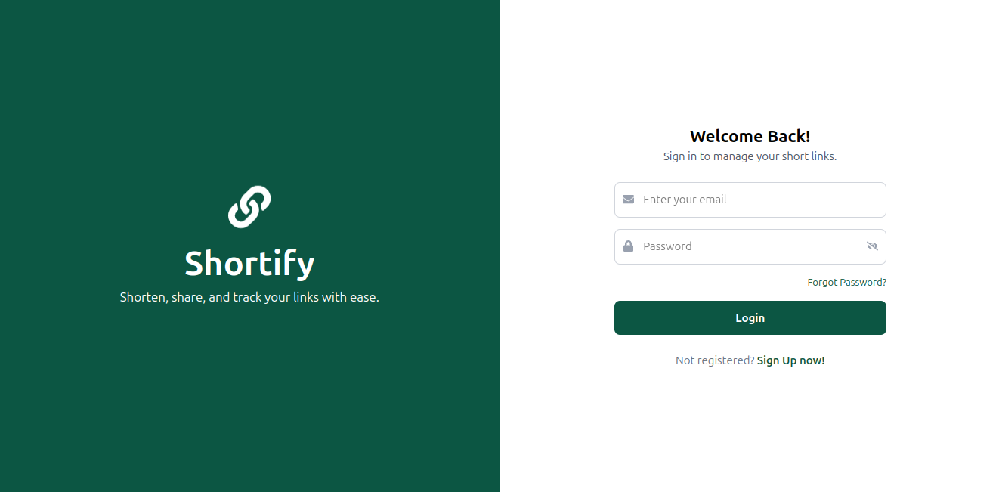

# Shortify Frontend

Welcome to the Shortify Frontend project! This application provides a user-friendly interface for shortening URLs, managing your links, and accessing related features. Built with modern web technologies, it ensures a seamless and efficient user experience.

## Table of Contents

- [Screenshots](#screenshots)
- [Features](#features)
- [Technologies Used](#technologies-used)
- [Getting Started](#getting-started)
  - [Prerequisites](#prerequisites)
  - [Installation](#installation)
  - [Running the Application](#running-the-application)
- [Project Structure](#project-structure)
- [Routes and Pages](#routes-and-pages)
- [Components Overview](#components-overview)
- [API Integration](#api-integration)
- [Authentication and Authorization](#authentication-and-authorization)
- [Error Handling](#error-handling)
- [Styling](#styling)
- [Contributing](#contributing)
- [License](#license)

## Screenshots
Here are some UI previews of Shortify-frontend:

### Shortify Home Page


### Shortify Login Page



## Features

- **URL Shortening**: Convert long URLs into concise, shareable links.
- **Link Management**: View, edit, and delete your shortened URLs.
- **User Authentication**: Secure login and registration system.
- **Dashboard**: Access a personalized dashboard with your link statistics.
- **Admin Panel**: Manage users and oversee application metrics (admin only).
- **Responsive Design**: Optimized for various devices and screen sizes.

## Technologies Used

- **Frontend**: React.js, Vite, Tailwind CSS
- **State Management**: React Hooks, Context API
- **Routing**: React Router
- **HTTP Client**: Axios
- **Animations**: Framer Motion
- **Form Handling**: React Hook Form
- **Validation**: Yup
- **Icons**: React Icons

## Getting Started

Follow these instructions to set up and run the project locally.

### Prerequisites

- [Node.js](https://nodejs.org/) (v14 or higher)
- [npm](https://www.npmjs.com/) or [yarn](https://yarnpkg.com/)

### Installation

1. **Clone the Repository**:

   ```bash
   git clone https://github.com/ParamDhama/shortify-frontend.git
   cd shortify-frontend
   ```

2. **Install Dependencies**:

   Using npm:

   ```bash
   npm install
   ```

   Or using yarn:

   ```bash
   yarn install
   ```

### Running the Application

To start the development server:

Using npm:

```bash
npm run dev
```

Or using yarn:

```bash
yarn dev
```

The application will be accessible at `http://localhost:5173`.

## Project Structure

The project's directory structure is organized as follows:

```
shortify-frontend/
├── public/
├── src/
│   ├── api/
│   ├── components/
│   ├── pages/
│   ├── routes/
│   ├── utils/
│   ├── App.jsx
│   ├── main.jsx
│   └── index.css
├── .gitignore
├── package.json
├── README.md
└── vite.config.js
```

- `public/`: Static assets.
- `src/api/`: API client and endpoint definitions.
- `src/components/`: Reusable UI components.
- `src/pages/`: Page components corresponding to routes.
- `src/routes/`: Route definitions and configurations.
- `src/utils/`: Utility functions and helpers.
- `src/App.jsx`: Main application component.
- `src/main.jsx`: Entry point for React.
- `src/index.css`: Global styles.

## Routes and Pages

The application includes the following routes:

- **Public Routes**:
  - `/`: Home page
  - `/redirect/:slug`: Redirects to the original URL based on the slug
- **Authentication Routes**:
  - `/auth/login`: User login
  - `/auth/sign-up`: User registration
  - `/auth/forgot-password`: Password recovery
  - `/auth/reset-password/:token`: Reset password
  - `/auth/verify/:token`: Email verification
  - `/auth/resend-verify`: Resend verification email
- **User Routes**:
  - `/user/dashboard/*`: User dashboard with nested routes
  - `/user/settings`: User settings
- **Admin Routes**:
  - `/admin`: Admin dashboard
- **Miscellaneous**:
  - `*`: 404 Not Found page

## Components Overview

- **Dashboard Components**:
  - `Sidebar`: Navigation menu for the dashboard.
  - `DashboardCard`: Displays key metrics.
  - `ChartComponent`: Visual representation of link statistics.
  - `LinkTable`: Table of user's shortened URLs.
  - `RecentLinks`: List of recently created links.
  - `RecentQRCode`: QR codes for recent links.
  - `ShortenUrl`: Form to create new shortened URLs.
  - `Setting`: User settings and preferences.
- **Authentication Components**:
  - `Login`: User login form.
  - `Register`: User registration form.
  - `ForgotPassword`: Form to request password reset.
  - `ResetPassword`: Form to set a new password.
  - `VerifyEmail`: Email verification status.
  - `ResendVerify`: Resend verification email form.
- **Miscellaneous Components**:
  - `ProtectedRoute`: Higher-order component to protect routes.
  - `NotFound`: 404 error page.

## API Integration

The application interacts with a backend API for various operations:

- **API Client**: Configured using Axios in `src/api/apiClient.js`. It includes default headers and interceptors for handling requests and responses.
- **Endpoints**: Defined in `src/api/endpoints.js`. Example:

  ```javascript
  const BASE_URL = 'http://localhost:5000';

  const endpoints = {
    url: {
      GET_URLS: `${BASE_URL}/api/urls`,
      CREATE_URL: `${BASE_URL}/api/urls`,
      DELETE_URL: (slug) => `${BASE_URL}/api/urls/${slug}`,
      // Add more endpoints as needed
    },
    auth: {
      LOGIN: `${BASE_URL}/api/auth/login`,
      REGISTER: `${BASE_URL}/api/auth/register`,
      // Add more endpoints as needed
    },
  };

  export default endpoints;
  ```

- **Usage Example**:

  ```javascript
  import apiClient from '../api/apiClient';
  import endpoints from '../api/endpoints';

  const fetchUrls = async () => {
    try {
      const response = await apiClient.get(endpoints.url.GET_URLS);
      // Handle response data
    } catch (error) {
      // Handle error
    }
  };
  ```

## Authentication and Authorization

- **Authentication**: Managed using JWT tokens. Upon successful login or registration, a token is stored in `localStorage` and included in the `Authorization` header for subsequent API requests.
- **Protected Routes**: The `ProtectedRoute` component ensures that only authenticated users can access certain routes. It checks for the presence of a valid token and redirects unauthenticated users to the login page.

## Error Handling

- **Global Error Handling**: Implemented using Axios interceptors to catch API errors and provide user-friendly feedback.
- **404 Page**: A custom animated 404 page using Framer Motion to enhance user experience when they visit an invalid URL.
- **Try-Catch Blocks**: Ensures proper error handling in API calls and displays error messages when necessary.
- **Form Validation**: Uses Yup and React Hook Form to validate user inputs, ensuring data integrity before sending requests.

## Styling

- **Tailwind CSS**: Used for designing a modern, responsive, and highly customizable UI.
- **Custom Scrollbar**: Styled scrollbar using the color `#0c5643` to match the theme.
- **Framer Motion**: Added smooth animations for an enhanced user experience.
- **Dark Mode Ready**: The app uses a dark-themed design by default with clean and professional-looking components.

## Contributing

Contributions are welcome! If you’d like to improve the project, follow these steps:

1. **Fork the Repository**  
   Click the “Fork” button at the top right of the repository page.

2. **Clone Your Fork**  
   ```bash
   git clone https://github.com/your-username/shortify-frontend.git
   cd shortify-frontend
   ```

3. **Create a New Branch**  
   ```bash
   git checkout -b feature-name
   ```

4. **Make Your Changes**  
   Implement your improvements and ensure everything works properly.

5. **Commit Your Changes**  
   ```bash
   git commit -m "Add feature-name"
   ```

6. **Push to Your Fork**  
   ```bash
   git push origin feature-name
   ```

7. **Submit a Pull Request**  
   Open a pull request from your forked repository to the main project.

## License

This project is open-source and available under the [MIT License](LICENSE).

---

### 💡 Notes:
- Ensure the backend is running and accessible at `http://localhost:5000` (or update the `BASE_URL` in `endpoints.js`).
- Make sure you have valid authentication credentials when testing protected routes.
- If you encounter any issues, feel free to open an issue on the GitHub repository.

🚀 **Enjoy using the Shortify!** 🎯